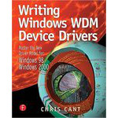

# Windows Driver Model (WDM)

  
## Introduction
If you are newcomer in Windows driver model and looking for very basic tutorials for writing Windows driver model in assembly and c/c++ language. This repository is what you want in order to learn more about Windows driver model. All of codes are compiled and tested based on WDK 7600 and Windows XP platforam, enjoy !
  
## Assembly
ch0. <a href="https://steward-fu.github.io/website/driver/wdm/wdk-7.1/asm_setup.htm">prepare</a>  
ch1. <a href="https://steward-fu.github.io/website/driver/wdm/wdk-7.1/asm_hello.htm">hello, world!</a>  
  
## C/C++
ch0. <a href="https://steward-fu.github.io/website/driver/wdm/wdk-7.1/cpp_setup.htm">prepare</a>  
ch1. <a href="https://steward-fu.github.io/website/driver/wdm/wdk-7.1/cpp_hello.htm">hello, world!</a>  
  
### https://steward-fu.github.io/website/index.htm
